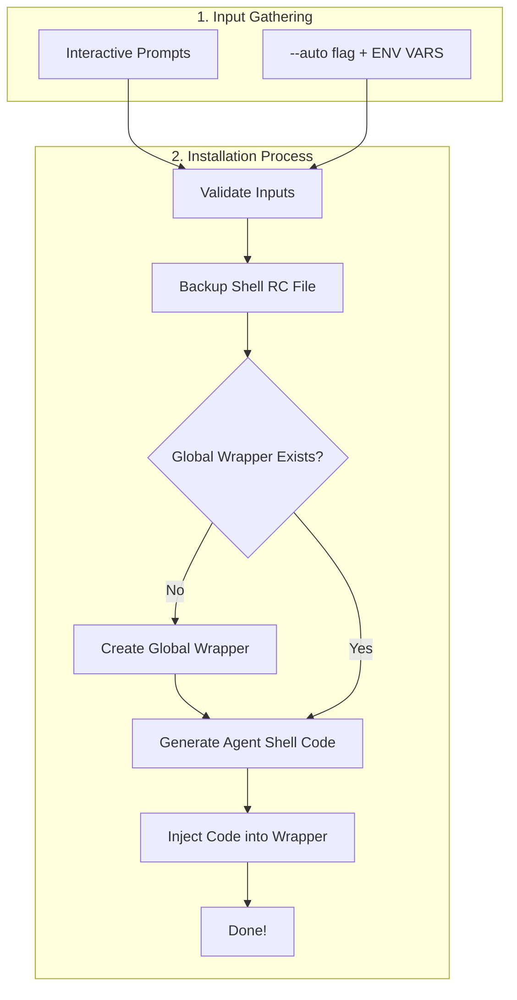

# Codex CLI Generic Agent Installer

A reusable Bash script to install and manage custom Codex CLI agent profiles in your shell with a single command.

## Table of Contents
- [🚀 **What is This?**](#-what-is-this)
- [⚡ **Quick Start Guide**](#-quick-start-guide)
- [🧠 **Core Concepts**](#-core-concepts)
- [⚙️ **How It Works**](#️-how-it-works)
- [🧰 **Commands & Reference**](#-commands--reference)
- [🆘 **Troubleshooting & FAQ**](#-troubleshooting--faq)

## 🚀 What is This?
- **What**: A Bash 4+ script that injects Codex CLI agent aliases into your `.zshrc` or `.bashrc` file.
- **Why**: To create reusable, shareable, and easily managed shell commands that trigger specific Codex agent behaviors defined in markdown files.
- **Highlights**:
  - **Interactive & Automated**: Run with prompts or fully scripted with environment variables.
  - **Safe**: Automatically backs up your shell RC file before making changes.
  - **Organized**: Groups all generated code inside a versioned, collapsible block for clean management.
  - **Flexible**: Supports tiered aliases (e.g., `my-agent-low`, `my-agent-high`) and easy uninstalls.

## ⚡ Quick Start Guide

### 1. Prerequisites
- **Bash 4+**: Check with `bash --version`. *(macOS users may need `brew install bash`)*.
- **Codex CLI**: Check with `command -v codex`.
- **An Agent Profile**: Use the sample `Profile/markdown.md` from this repo to start.

### 2. Get the Installer
```bash
# Clone the repository
git clone [https://github.com/bizzkoot/codex-profile-installer.git](https://github.com/bizzkoot/codex-profile-installer.git)
cd codex-profile-installer

# Make the installer executable
chmod +x codex_profile_installer.sh
```

### 3. Install an Agent
Choose one of the following methods.

#### Option A: Automated Install (Recommended)
This non-interactive mode is best for consistency. The example installs the sample `markdown.md` profile as a new `mdexpert` command.
```bash
PROFILE_FILE="Profile/markdown.md" \
TRIGGER="mdexpert" \
TYPE="Planning" \
GROUP_GLOBAL="Y" \
./codex_profile_installer.sh --auto --mode overwrite
```

#### Option B: Interactive Install
Run the script without flags to get interactive prompts that guide you through the setup.
```bash
./codex_profile_installer.sh
# Follow the on-screen prompts to configure your agent.
```

### 4. Activate and Verify
1.  **Reload your shell** to activate the new command:
    ```bash
    # For Zsh
    source ~/.zshrc

    # For Bash
    source ~/.bashrc
    ```
2.  **Check the status** to see your agent:
    ```bash
    codex-generic-status
    # Expected output:
    # 📂 Installed Codex agents (generic):
    #  • mdexpert (active in this shell)
    ```
3.  **Use it!**
    ```bash
    # This command now launches Codex CLI with your profile and task pre-loaded.
    mdexpert "Draft a README for a new project about task management."
    ```

## 🧠 Core Concepts

- **Trigger**: The main command you'll use in your shell (e.g., `mdexpert`).
- **Profile**: A markdown file containing the system prompt, instructions, and behavior for your agent.
- **Tiers**: Create variants of your trigger with different reasoning efforts (e.g., `mdexpert-low`, `mdexpert-mid`). The base trigger defaults to the `mid` tier.
- **Global Wrapper**: An optional `# BEGIN`/`# END` block in your RC file that neatly contains all agents installed by this script, making them easy to find or remove.

### Planning vs. Execution Type
Choosing a `TYPE` sets important defaults for your agent's behavior. This is the key difference:

| Feature | `Planning` (Default) | `Execution` |
| :--- | :--- | :--- |
| **Sandbox** | `read-only` | `workspace-write` |
| **Goal** | Safely analyze, review, and plan tasks. | Modify files and execute commands. |
| **Approval** | Asks before running **untrusted** code. | Asks only **on request**. |
| **Web Search** | **Enabled** by default. | **Disabled** by default. |
| **Verbosity** | `low` | `medium` |

**Choose `Planning`** for agents that write documentation, analyze code, or answer questions.
**Choose `Execution`** for agents that refactor code, run tests, or manage files.

## ⚙️ How It Works
The script intelligently modifies your shell's startup file (`.zshrc` or `.bashrc`).

### Installation Flow
Whether you run in interactive or automated mode, the script follows the same core logic after gathering its instructions.



### What Gets Written to Your RC File
The script adds a clean, self-contained block. With `GROUP_GLOBAL=Y`, it looks like this:

```bash
# ... your other shell configuration ...

# BEGIN GENERIC CODEX AGENTS v0.0.1
# (Agents installed by codex_profile_installer v0.0.1 will appear below)

# BEGIN GENERIC CODEX AGENT (mdexpert) v0.0.1
# Generated: ...
# Trigger: mdexpert
# Type: Planning
# ...
#
# default alias -> chosen default tier
mdexpert() { mdexpert-mid "$@"; }

# ... tier-specific functions calling 'codex' ...
# END GENERIC CODEX AGENT (mdexpert)

# END GENERIC CODEX AGENTS v0.0.1
```

## 🧰 Commands & Reference

### Non-Interactive Installation (`--auto`)
For automated setups, use the `--auto` flag and set these environment variables:

| Variable | Required | Description |
| :--- | :--- | :--- |
| `TRIGGER` | **Yes** | The command name to create (e.g., `doc_writer`). |
| `TYPE` | **Yes** | `Planning` or `Execution`. |
| `PROFILE_FILE` | **Yes** | Path to the markdown profile file. |
| `MODEL` | No | `gpt-5` (default) or `gpt-5-codex`. |
| `TIERS` | No | CSV of tiers (`min,low,mid,high`). Defaults to `mid`. |
| `GROUP_GLOBAL`| No | `Y` to use the global wrapper. Defaults to `N`. |
| `FILE_OPENER` | No | `vscode` (default), `cursor`, `none`, etc. |

### Managing Agents
- **List Agents**: `codex-generic-status`
- **Uninstall One**: `./codex_profile_installer.sh --uninstall --trigger mdexpert`
- **Uninstall All**: `./codex_profile_installer.sh --uninstall --all`
- **Migrate to Wrapper**: `./codex_profile_installer.sh --migrate-global`

### Full CLI Flag Reference

| Flag | Purpose |
| :--- | :--- |
| `--auto` | Use environment variables instead of prompts. |
| `--mode ` | Action to take if a trigger already exists. |
| `--uninstall` | Enter uninstall mode. Use with `--all` or `--trigger`. |
| `--trigger ` | Target a specific trigger to uninstall. |
| `--all` | Uninstall all agents created by this script. |
| `--migrate-global`| Move older, "loose" agents into the global wrapper. |
| `--dry-run` | Preview migration changes without modifying files. |
| `--help` | Show the help message. |

## 🆘 Troubleshooting & FAQ

- **`./codex_profile_installer.sh: command not found`**
  - You forgot to make the script executable. Run `chmod +x codex_profile_installer.sh`.

- **`mdexpert: command not found` after install**
  - You need to reload your shell. Run `source ~/.zshrc` or `source ~/.bashrc`.

- **`codex: command not found` when running my agent**
  - The Codex CLI itself is not in your shell's `PATH`. Check your Codex CLI installation.

- **How do I update an agent's profile?**
  - Just re-run the installation command with the same `TRIGGER` and `--mode overwrite`. It will safely replace the old block with the new one.

- **Where is the backup file?**
  - A backup is created in the same directory as your RC file (e.g., `~/.zshrc.bak.20250919103200`).

