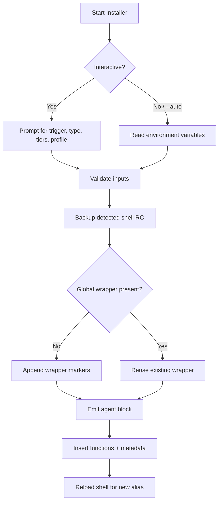

# Codex CLI Generic Agent Installer

Codex CLI Generic Agent Installer (`codex_profile_installer.sh`) adds reusable Codex CLI agent profiles to your shell so you can trigger the right behavior with a single command.

## Table of Contents
- [🚀 Executive Summary](#-executive-summary)
- [⚡ Quick Start Guide](#-quick-start-guide)
- [🧠 Core Concepts](#-core-concepts)
- [🛠️ Detailed Implementation](#-detailed-implementation)
- [🧩 Advanced Usage](#-advanced-usage)
- [📚 Reference Materials](#-reference-materials)
- [🆘 Troubleshooting & FAQ](#-troubleshooting--faq)

## 🚀 Executive Summary
- 🎯 **What**: A Bash 4+ installer that injects Codex CLI agent aliases into your shell RC file (bash/zsh) and keeps them grouped for easy management.
- 🌍 **Why**: Share one general-purpose installer so every developer can bring their own markdown (or other) profile without editing the script.
- ✨ **Highlights**: Interactive or scripted installs, automatic shell RC backups, optional global wrapper grouping, tiered aliases per trigger, uninstall & migration utilities.
- 🏷️ **Version**: v0.0.1 (alpha) — see `GLOBAL_BEGIN/END` markers for future upgrades.

## ⚡ Quick Start Guide

### 0. Grab the Installer
```bash
git clone https://github.com/bizzkoot/codex-profile-installer.git
cd codex-profile-installer
```

### 1. Prerequisites
- 🧰 Bash `>= 4.0` (macOS users may need Homebrew Bash at `/opt/homebrew/bin/bash`).
- 🤖 Codex CLI installed and available on your `PATH`.
- 📄 The profile markdown you want to install (sample: `Profile/markdown.md`).

### 2. Install the Sample Markdown Agent
```bash
# Run from the repository root
bash codex_profile_installer.sh
```
During the interactive prompts, provide:
- 🔔 **Trigger**: `markdown`
- 🧭 **Type**: `Planning` or `Execution` depending on your workflow
- 🧪 **Model**: choose between `gpt-5` or `gpt-5-codex`
- 📈 **Tiers**: pick one or more reasoning tiers (e.g., `mid`, `high`)
- 🗂️ **Profile Source**: paste the markdown when prompted (open `Profile/markdown.md` in an editor and copy/paste it)
- 🧷 **Global Wrapper**: choose `Y` to nest agents between the script’s begin/end markers.

### 3. Verify the Installation
- 🔄 Reload your shell (`source ~/.zshrc` or `source ~/.bashrc`).
- 📋 Run `codex-generic-status` to list active aliases added by the installer.
- 🚨 Trigger your agent, e.g. `markdown "Draft onboarding README"`.

### 4. Customize for Your Own Profile
```bash
PROFILE_FILE="/path/to/your_profile.md" \
TRIGGER="writer" TYPE="Planning" \
MODEL="gpt-5" TIERS="mid,high" \
GROUP_GLOBAL="Y" \
bash codex_profile_installer.sh --auto --mode overwrite
```
Replace the environment variables with your preferred trigger, model, tiers, and markdown file. This non-interactive path is how you point the installer at a profile file directly.

## 🧠 Core Concepts
- 🪄 **Trigger**: The shell function name you will run (e.g., `markdown`, `writer-high`).
- 🧭 **Type**: `Planning` agents default to read-only sandbox and low verbosity; `Execution` agents allow workspace writes and medium verbosity.
- 🧠 **Model**: `gpt-5` or `gpt-5-codex`. Tiers adjust the `model_reasoning_effort` the CLI requests.
- 🎚️ **Tiers**: One trigger creates tier-specific helpers (e.g., `markdown-mid`, `markdown-high`) plus a default alias pointing to the first non-mid tier if desired.
- 📝 **Profile Text**: Markdown fed to Codex CLI before the task delimiter. Use any content or start from `Profile/markdown.md`.
- ✂️ **User Task Delimiter**: `========================= USER TASK =========================` separates profile text from each prompt.
- 🪟 **File Opener**: Controls which editor Codex CLI opens files in (`vscode`, `windsurf`, `cursor`, or `none`).
- 🧳 **Global Wrapper**: Optional comment banner (`# BEGIN/END GENERIC CODEX AGENTS v0.0.1`) used to group installer-managed content for fast removal.

## 🛠️ Detailed Implementation

### Installation Flow


### What Gets Written
- 📦 A `# BEGIN/END GENERIC CODEX AGENT (<trigger>)` block containing:
  - 🔁 A default alias (`trigger() { trigger-tier "$@"; }`).
  - 🧩 Tier-specific shell functions calling `codex` with sandbox, approval, and verbosity defaults.
  - 🧾 The profile content embedded inside a HEREDOC (`__CODEX_PROFILE__`).
  - 📊 Helper status functions (`codex-generic-status`) if not already defined.
- 🗂️ Optional global wrapper comments around all installer-managed blocks.
- 🧾 A one-line export (`CODEX_GENERIC_AGENTS`) tracking installed triggers in the current shell.

### Safety Nets
- 🛡️ RC files are backed up to `<rc>.bak.<timestamp>` before modification.
- 🧹 `safe_range_delete` removes existing blocks cleanly if you overwrite or delete a trigger.
- ✅ The installer refuses invalid trigger names (must match shell function rules).

## 🧩 Advanced Usage

### Non-Interactive Automation (`--auto`)
Set environment variables, then run the script with `--auto` to skip prompts.

| Variable | Required | Description |
|----------|----------|-------------|
| `TRIGGER` | Yes | Function name to create (e.g., `doc`). |
| `TYPE` | Yes | `Planning` or `Execution`. |
| `MODEL` | No | Defaults to `gpt-5`. |
| `TIERS` | No | CSV of tiers (`min,low,mid,high` for gpt-5; `low,mid,high` for gpt-5-codex). |
| `FILE_OPENER` | No | Editor to launch (`vscode`, `windsurf`, `cursor`, `none`). |
| `WS_EXEC` | No | `1` enables web search for Execution agents. |
| `ENDMARK` | No | Custom end marker when pasting inline profile text. |
| `PROFILE_FILE` | Yes | Path to the markdown profile. |
| `GROUP_GLOBAL` | No | `Y` groups blocks inside the global wrapper. |

`--mode` controls how existing triggers are handled: `overwrite` (default), `skip`, or `delete` before reinstalling.

### Managing Installed Agents
- 📋 **List**: `codex-generic-status` prints generic agents present in the current shell session.
- 🔁 **Source Selection**: the installer can prompt to `source` your RC after install, or rerun `source ~/.zshrc` manually.
- 🗃️ **Global Grouping**: pass `GROUP_GLOBAL=Y` (or answer `Y` interactively) to keep all managed agents inside the versioned wrapper for easy diffing.

### Uninstalling
```bash
bash codex_profile_installer.sh --uninstall --trigger markdown
bash codex_profile_installer.sh --uninstall --all
```
Both commands back up your RC before removing blocks. Without flags, the script offers an interactive menu.

### Migrating into the Global Wrapper
```bash
bash codex_profile_installer.sh --migrate-global --dry-run
bash codex_profile_installer.sh --migrate-global --include-any-version --triggers markdown,writer
```
- Moves loose per-trigger blocks between the `GLOBAL_BEGIN/END` markers.
- `--dry-run` previews actions; `--include-any-version` migrates blocks from older installer versions.

### Customizing File Openers & Web Search
- 🪟 Set `FILE_OPENER` per install or export `CODEX_FILE_OPENER` before launching a trigger.
- 🌐 Planning agents enable web search by default; set `WS_EXEC=1` if you want Execution agents to opt in.

### Working with Multiple Tiers
- 🪜 Each tier results in an alias like `markdown-low`, `markdown-mid`, `markdown-high`.
- 🎯 The base trigger (`markdown`) points to `mid` by default or to the first selected tier when `mid` is absent.
- 🎛️ Adjust reasoning effort by choosing different tier aliases at runtime.

## 📚 Reference Materials

### Repository Layout
```
.
├── README.md
├── codex_profile_installer.sh
└── Profile
    └── markdown.md
```

### CLI Flags Overview
| Flag | Purpose |
|------|---------|
| `--auto` | Use environment variables instead of prompts. |
| `--mode <overwrite|skip|delete>` | Decide how to handle existing triggers. |
| `--uninstall` | Enter uninstall mode (combine with `--all` or `--trigger`). |
| `--all` | Remove every agent created by this installer. |
| `--trigger <name>` | Target a single trigger for uninstall. |
| `--migrate-global` | Wrap loose blocks inside the global markers. |
| `--dry-run` | Preview migration changes without editing files. |
| `--include-any-version` | Migrate blocks regardless of version stamp. |
| `--triggers csv` | Filter which triggers migrate. |
| `--help` | Print usage summary. |

### Helper Functions Added to Your Shell
- 🧾 `codex-generic-status`: Lists installer-managed aliases and whether they are loaded.
- 🔄 `codex-status`: Delegates to `codex-generic-status` when no other function exists.
- 🧰 `${trigger}` / `${trigger}-${tier}`: Call Codex CLI with embedded profile text and sanitized defaults.

## 🆘 Troubleshooting & FAQ
- 📦 **Where did my backup go?** Every run creates `~/.zshrc.bak.<timestamp>` (or the detected RC file). Restore by copying it back.
- 🧱 **Installer says Bash 4 required.** Install a newer Bash (e.g., `brew install bash`) and run the script with that binary: `bash codex_profile_installer.sh` or `/opt/homebrew/bin/bash codex_profile_installer.sh`.
- 🔁 **Can I reuse profiles between machines?** Yes—commit your markdown files and run the installer on each machine with identical triggers.
- ♻️ **How do I update an agent?** Rerun the installer with the same trigger and `--mode overwrite` (or choose overwrite interactively). A fresh block replaces the old one.
- 🚫 **Why is my trigger missing in new shells?** Ensure you sourced the RC file or opened a new terminal. Check `codex-generic-status` for active functions.
- ✂️ **What if my profile includes the delimiter string?** Change the delimiter by setting `ENDMARK` (interactive prompt or env var) and update your profile accordingly.
- 🚪 **How do I disable file opening?** Set `FILE_OPENER=none` during install—the generated functions respect `CODEX_FILE_OPENER` overrides per session.


